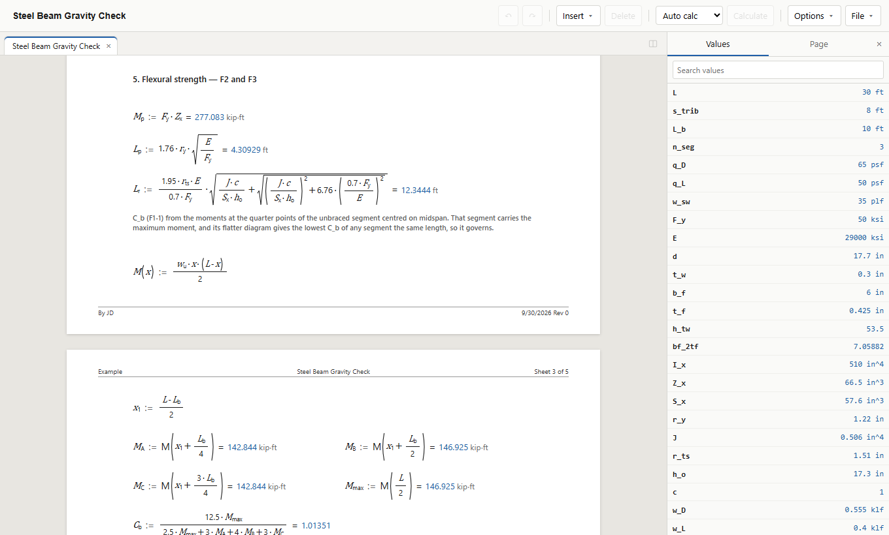

# jamCalc

Engineering calculation sheets where the maths looks the way you would write
it, units are checked as you go, and the page prints the way it reads. Made
for structural and civil design calcs that get printed, checked and submitted.

**Version 0.1 — a first preview.** It is early: useful to try and to give
feedback on, not yet for calculations you seal. See
[what it cannot do yet](#what-it-cannot-do-yet).

## What it does

- **Write the calculation, see the notation.** Type `M_u := w_u*L^2/8 = kip*ft`
  and the sheet shows *M*u := *w*u·*L*²⁄8 = 187.5 kip·ft —
  fractions, roots, subscripts and Greek letters drawn properly, on the page
  where you put them.
- **Units are real.** Every value carries its units, mismatches are errors,
  and results show in whichever unit you choose — including `kip*ft`,
  `in^4` and square roots of stresses (`sqrt(f'c)` works).
- **It recalculates as you edit**, top to bottom and left to right, like
  reading the page. On a big sheet, switch to manual and press F9; anything out
  of date is marked, and printing it asks first.
- **More than equations:** prose that quotes live values, tables you can look
  values up in, plots, pictures, functions you define, and `if` for code
  checks with branches.
- **Prints like a calc package.** Real pages at your paper size and margins,
  headers and footers you lay out yourself — project, job number, by and
  checked, *Sheet 12 of 40*, a logo — saved as templates for the office.
- **Several sheets at once**, in tabs or side by side.
- **Plain files.** A sheet is a readable text file (`.jc`) that works with
  version control, and every sheet records the version that saved it.

## Get it

**Windows:** download the installer, or the portable app that runs without
installing, from the [Releases page](https://github.com/pookpookaman/jamCalc/releases).

**In a browser:** the same app, with nothing to install, at
**[pookpookaman.github.io/jamCalc](https://pookpookaman.github.io/jamCalc/)**. Use Chrome or Edge. It
runs entirely in your browser: sheets are opened from and saved to your own
computer, and never uploaded.

Then [Getting started](docs/getting-started.md) walks through a first sheet.

## What it cannot do yet

- **It has not been proved on real work.** The engine is tested — about 700
  automated tests, and a set of reference sheets whose results are pinned —
  but no one
  has yet reproduced a set of real submitted calcs in it and checked the
  answers. Check its results as you would any calculation.
- **No design codes are built in,** on purpose. AISC, ACI, ASCE and the rest
  are written out in your sheets, where they can be read and checked.
- **Windows only** for the desktop app. The browser version runs anywhere
  Chrome or Edge does; macOS comes later.
- **No import** from other calculation programs.

## Documentation

| | |
|---|---|
| [Getting started](docs/getting-started.md) | A first sheet, the keys, saving and printing |
| [The sheet language](docs/language.md) | Writing calculations: units, operators, functions, tables, errors |
| [Headers and footers](docs/headers.md) | Title blocks, fields, templates and sheet numbering |
| [The command line and API](docs/api.md) | Reading, checking and editing sheets from scripts |
| [Changelog](CHANGELOG.md) | What changed in each version, and any result that changed |
| [Development](docs/development.md) | Building it, testing it, and how the code is laid out |
| [Contributing](CONTRIBUTING.md) | The rules for a change, and how to send one |
| [Security](SECURITY.md) | Reporting a problem, and what a sheet can and cannot do |

## Licence

MIT — see [LICENSE](LICENSE).
